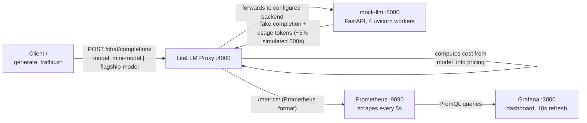

# LLM Cost & Observability Stack

FinOps-style observability for LLM API usage: cost, tokens, latency, and error
rate tracked per model tier and visualized in Grafana — the same
Prometheus/Grafana playbook used for infra cost monitoring, applied to LLM
spend instead of cloud spend.

Most LLM cost/observability content comes from ML engineers. This is the
infra/DevOps angle: the same cost-attribution instincts you'd apply to a
cloud bill, pointed at a newer kind of bill.

## Architecture



- **mock-llm** — a minimal OpenAI-compatible chat completions endpoint.
  Stands in for a real provider so the stack runs with zero API keys/cost.
  Sleeps 0.2–1.2s per request, fakes token usage, randomly returns 500s
  (~5%) so the dashboard has a real error rate to show. Swapping this for a
  real provider is a one-line change to `api_base` in LiteLLM's config —
  nothing downstream changes.
- **LiteLLM proxy** — routes requests to whichever backend a model alias
  maps to, retries transparently on failure, computes per-request cost from
  configured per-token pricing, and exports everything as Prometheus
  metrics.
- **Prometheus** — scrapes LiteLLM's `/metrics/` endpoint every 5 seconds.
- **Grafana** — fully file-provisioned dashboard: spend, tokens, latency,
  and errors, all broken down by model tier.

## Why LiteLLM

Without it there are two worse options: hand-write provider-specific
routing/auth/pricing logic yourself and maintain it as prices change, or pay
for a hosted LLM-observability SaaS that routes your data through a third
party. LiteLLM gives you one request/response shape regardless of what's
behind it, cost math from a one-time price list instead of code you write
yourself, Prometheus metrics with one config line, and automatic retries on
transient failures — self-hosted and free.

## The cost mechanic

`mini-model` and `flagship-model` both route to the exact same mock
backend, but each carries different configured per-token pricing (modeled
after real GPT-4o-mini vs GPT-4o rates):

| Tier | Input $/token | Output $/token |
|---|---|---|
| `mini-model` | 0.00000015 | 0.0000006 |
| `flagship-model` | 0.0000025 | 0.00001 |

**The key mechanic:** LiteLLM prices a response using the pricing attached
to the *requested* model alias — not whatever backend actually served it.
That's what makes a ~17x cost difference visible on the dashboard against a
single physical backend. In production the same mechanic runs in reverse:
an alias like `internal-summarizer` can point at whatever real backend you
want without callers ever knowing.

## Run it

```bash
docker-compose up -d --build
./generate_traffic.sh 100   # fire sample requests across both tiers
```

Open Grafana at http://localhost:3000 (anonymous admin access enabled for
local demo purposes) — the "LLM Cost & Observability" dashboard is
pre-provisioned.

## Dashboard panels

| Panel | Query | Shows |
|---|---|---|
| Total Spend | `sum(litellm_spend_metric_total)` | Cumulative dollars since stack start |
| Total Requests | `sum(litellm_requests_metric_total)` | Cumulative request count |
| Total Tokens | `sum(litellm_total_tokens_metric_total)` | Cumulative input + output tokens |
| p95 API Latency | `histogram_quantile(0.95, sum by (le) (rate(litellm_llm_api_latency_metric_bucket[5m])))` | 95th-percentile response time, last 5 min |
| Spend by Model Tier | `sum by (requested_model) (increase(litellm_spend_metric_total[5m]))` | Cost per tier — the core FinOps panel |
| Tokens by Model Tier | `sum by (requested_model) (increase(litellm_input_tokens_metric_total[5m]))` | Token volume per tier, input vs output |
| Request Rate by Status | `sum by (status_code) (rate(litellm_proxy_total_requests_metric_total[5m]))` | Client-facing success/error rate |
| Deployment Failures | `sum by (requested_model) (litellm_deployment_total_requests_total) - sum by (requested_model) (litellm_deployment_success_responses_total)` | Upstream errors LiteLLM silently retried |

**What "p95" means:** sort every request's response time slowest to
fastest — p95 is the value where 95% of requests were faster than it. It's
deliberately not an average, since a couple of outliers barely move an
average but are exactly what a real user notices. In this stack, p95 often
reads higher than the mock backend's 0.2–1.2s sleep because concurrent
requests queue behind each other and LiteLLM's retries on simulated
failures add real wall-clock time — both honest contributors, not a bug.

## Real bugs hit while building this

1. **LiteLLM silent for ~60–90s on every start** — no log output during
   startup made it look hung. Confirmed via `docker stats` that CPU stayed
   non-zero — it was loading its internal pricing map, not crash-looping.
2. **Prometheus target down, HTTP 401** — LiteLLM's `/metrics` requires
   bearer auth by default; Prometheus's static scrape config sends none.
   Fixed with `require_auth_for_metrics_endpoint: false` (acceptable since
   the endpoint isn't exposed outside the Docker network).
3. **Scrape still failing after the auth fix** — `/metrics` 307-redirects
   to `/metrics/`, and Prometheus doesn't follow redirects on scrape.
   Pointed `metrics_path` at the resolved path directly.
4. **A PromQL bug dropped a label mid-query** — subtracting two metrics
   with `- on (model_id) ...` matched correctly but discarded
   `requested_model` from the result. Fixed by aggregating each side down
   to `requested_model` before subtracting.
5. **Grafana: "data source not found" after a config change** —
   `docker-compose restart` reuses the same container filesystem (incl.
   Grafana's sqlite state), so a datasource UID change collided with the
   old provisioned record. Fixed with `up -d --force-recreate` — a clean
   container instead of a restarted one.
6. **p95 latency read ~9s against a 0.2–1.2s backend** — a single Uvicorn
   worker meant concurrent requests queued behind each other, and the
   queueing delay got counted as latency. Fixed by running 4 workers.

## How I'd productionize this

- Swap `mock-llm` for a real provider — one line (`api_base`), nothing else
  changes.
- Long-term metrics storage: Prometheus alone isn't durable/long-retention
  — add remote-write to Thanos or Mimir.
- Alerting: LiteLLM already exposes `litellm_remaining_api_key_budget_metric`
  — wire an Alertmanager rule on spend-rate-exceeds-budget, plus error-rate
  and latency-SLO alerts.
- Chargeback: metrics already carry `team`, `user`, and `api_key_alias`
  labels — map those directly onto per-team/per-project cost breakdowns.
- Metrics auth: replace the disabled-auth shortcut with a scoped
  scrape-config credential or network-level isolation.
